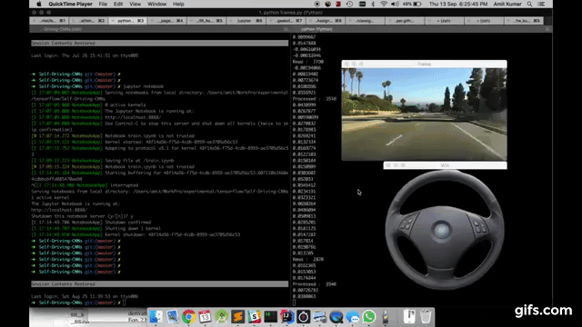

# Self Driving Car
[](https://www.linkedin.com/in/amitasviper/)

Self Driving Car Convolutional Neural Network implementation using TensorFlow.

<p align="center">
  
</p>

## Requirements
**Library** | **Version**
--- | ---
**Python** | **^2.7.0**
**Tensorflow** | **^1.8.0**
**Numpy** | **^1.14.3** 

## Try this on your machine
### Clone this repository
```sh
git clone https://github.com/amitasviper/Self-Driving-CNNs
cd Self-Driving-CNNs
```

### Install the required dependencies
```sh
pip install numpy tensorflow
```


### To use the pre-trained model, run the following command
```sh
python frames.py
```
